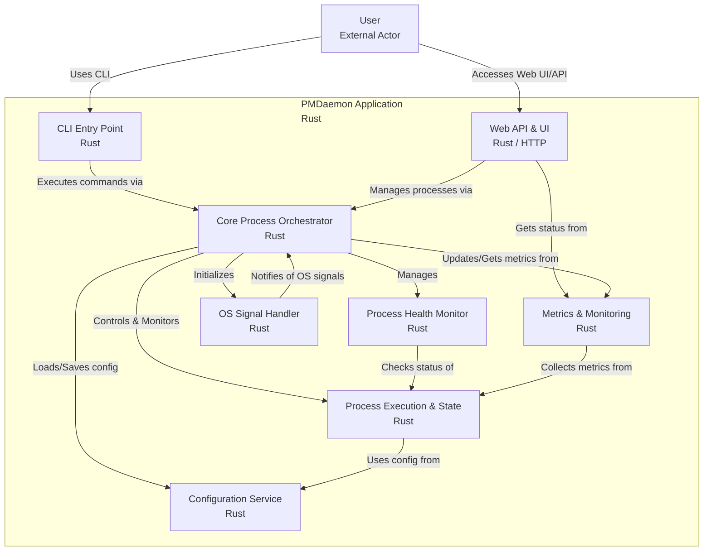

# PMDaemon - Advanced Process Manager

[](https://www.rust-lang.org)
[](https://opensource.org/licenses/MIT)
[]()
[]()

A high-performance process manager built in Rust, inspired by PM2 with innovative features that exceed the original. PMDaemon is designed for modern application deployment with advanced port management, real-time monitoring, and production-ready web APIs.

## 📑 Table of Contents

- [Key Features](#-key-features)
- [Installation](#-installation)
- [Quick Start](#-quick-start)
- [Command Reference](#-command-reference)
- [Configuration Options](#-configuration-options)
- [Web API](#-web-api)
- [Monitoring](#-monitoring)
- [Comparison with PM2](#-comparison-with-pm2)
- [Library Usage](#-library-usage)
- [Testing](#-testing)
- [Roadmap](#-roadmap)
- [Contributing](#-contributing)
- [License](#-license)

## The CLI ##


## 🚀 Key Features

### Core Process Management
- **Process Lifecycle** - Start, stop, restart, reload, and enhanced delete operations
- **Enhanced Delete Operations** - Bulk deletion, status-based deletion, and safe process shutdown
- **Clustering** - Run multiple instances with automatic load balancing
- **Auto-restart** - Automatic restart on crashes with configurable limits
- **Signal Handling** - Graceful shutdown with SIGTERM/SIGINT and custom signals
- **Configuration Persistence** - Process configs saved and restored between sessions

### Advanced Monitoring & Health Checks
- **Real-time Monitoring** - CPU, memory, uptime tracking with system metrics
- **Memory Limit Enforcement** - Automatic restart when processes exceed memory limits
- **HTTP Health Checks** - Monitor process health via HTTP endpoints with configurable timeouts
- **Script-based Health Checks** - Custom health check scripts for complex validation
- **Blocking Start Command** - Wait for processes to be healthy before returning from start command
- **Log Management** - Separate stdout/stderr files with viewing and following

### 🌟 Innovative Port Management (Beyond PM2)
- **Port Range Distribution** - Automatically distribute consecutive ports to cluster instances
- **Auto-assignment** - Find first available port in specified range
- **Conflict Detection** - Prevent port conflicts at the process manager level
- **Runtime Port Overrides** - Change ports during restart without modifying saved config
- **Port Visibility** - Display assigned ports in process listings

### Web API & Real-time Updates
- **REST API** - Full process management via HTTP with PM2-compatible responses
- **WebSocket Support** - Live process status and system metrics streaming
- **Production Web Server** - Built on Axum with CORS and security headers

## 📦 Installation

### From Source
```bash
git clone https://github.com/entrepeneur4lyf/pmdaemon
cd pmdaemon
cargo build --release
sudo cp target/release/pmdaemon /usr/local/bin/
```

### Using Cargo
```bash
cargo install pmdaemon
```

## 🚀 Quick Start

### Basic Process Management
```bash
# Start a process
pmdaemon start app.js --name myapp

# List all processes
pmdaemon list

# Stop a process
pmdaemon stop myapp

# Restart a process
pmdaemon restart myapp

# Delete a process (stops if running)
pmdaemon delete myapp

# Delete all processes
pmdaemon delete all --force

# Delete processes by status
pmdaemon delete stopped --status --force
```

### Clustering with Port Management
```bash
# Start 4 instances with port range
pmdaemon start server.js --instances 4 --port 4000-4003

# Auto-assign ports from range
pmdaemon start worker.js --port auto:5000-5100

# Runtime port override (doesn't modify saved config)
pmdaemon restart myapp --port 3001
```

### Memory Limits and Monitoring
```bash
# Set memory limit with auto-restart
pmdaemon start app.js --max-memory 100M

# Real-time monitoring with configurable intervals
pmdaemon monit --interval 2

# View logs
pmdaemon logs myapp

# Follow logs in real-time
pmdaemon logs myapp --follow
```

### Health Checks and Blocking Start
```bash
# Start with HTTP health check and wait for ready
pmdaemon start app.js --health-check-url http://localhost:9615/health --wait-ready

# Start with script-based health check
pmdaemon start worker.js --health-check-script ./health-check.sh --wait-ready

# Custom health check timeout
pmdaemon start api.js --health-check-url http://localhost:9615/status --wait-timeout 30s
```

### Web API Server
```bash
# Start web API server for remote monitoring
pmdaemon web --port 9615 --host 127.0.0.1
```

## 📋 Command Reference

| Command     | Description                | Example                                |
|-------------|----------------------------|----------------------------------------|
| `start`     | Start a new process        | `pmdaemon start app.js --name myapp`  |
| `stop`      | Stop a process             | `pmdaemon stop myapp`                 |
| `restart`   | Restart a process          | `pmdaemon restart myapp`              |
| `reload`    | Graceful restart           | `pmdaemon reload myapp`               |
| `delete`    | Delete process(es)         | `pmdaemon delete myapp`               |
|             | Delete all processes       | `pmdaemon delete all --force`         |
|             | Delete by status           | `pmdaemon delete stopped --status`   |
| `list`      | List all processes         | `pmdaemon list`                       |
| `monit`     | Real-time monitoring       | `pmdaemon monit --interval 2`         |
| `logs`      | View/follow process logs   | `pmdaemon logs myapp --follow`        |
| `info`      | Process details            | `pmdaemon info myapp`                 |
| `web`       | Start web API server       | `pmdaemon web --port 9615`            |

## 🔧 Configuration Options

### Process Configuration
```bash
pmdaemon start app.js \
  --name "my-app" \
  --instances 4 \
  --port 3000-3003 \
  --max-memory 512M \
  --env NODE_ENV=production \
  --cwd /path/to/app \
  --log-file /var/log/app.log \
  --health-check-url http://localhost:9615/health \
  --wait-ready
```

### Port Management Options

| Option                      | Description                            | Example                    |
|-----------------------------|----------------------------------------|----------------------------|
| `--port 3000`               | Single port assignment                 | Assigns port 3000          |
| `--port 3000-3005`          | Port range for clusters                | Distributes 3000-3005      |
| `--port auto:4000-4100`     | Auto-find available port               | First available in range   |

### Health Check Options

| Option                           | Description                            | Example                         |
|----------------------------------|----------------------------------------|---------------------------------|
| `--health-check-url <url>`       | HTTP endpoint for health checks        | `http://localhost:9615/health` |
| `--health-check-script <path>`   | Script to run for health validation    | `./scripts/health-check.sh`     |
| `--health-check-timeout <time>`  | Timeout for individual health checks   | `5s`, `30s`, `1m`               |
| `--health-check-interval <time>` | Interval between health checks         | `10s`, `30s`, `1m`              |
| `--health-check-retries <num>`   | Number of retries before failure       | `3`, `5`, `10`                  |
| `--wait-ready`                   | Block start until health checks pass   | Boolean flag                    |
| `--wait-timeout <time>`          | Timeout for blocking start             | `30s`, `1m`, `5m`               |

### Delete Options

| Option                      | Description                            | Example                         |
|-----------------------------|----------------------------------------|---------------------------------|
| `delete <name>`             | Delete single process by name/ID       | `pmdaemon delete myapp`         |
| `delete all`                | Delete all processes                   | `pmdaemon delete all`           |
| `delete <status> --status`  | Delete processes by status             | `pmdaemon delete stopped --status` |
| `--force` / `-f`            | Skip confirmation prompts             | `pmdaemon delete all --force`   |

**Valid statuses for `--status` flag:**
- `starting` - Processes currently starting up
- `online` - Running processes
- `stopping` - Processes currently shutting down
- `stopped` - Processes that have exited
- `errored` - Processes that crashed or failed
- `restarting` - Processes currently restarting

**Safety Features:**
- All delete operations automatically stop running processes before deletion
- Interactive confirmation prompts for bulk operations (unless `--force` is used)
- Graceful process shutdown with proper cleanup of files and ports
- Clear feedback showing how many processes were stopped vs. deleted

## 🌐 Web API

PMDaemon provides a comprehensive REST API compatible with PM2:

### Endpoints

| Method   | Endpoint                    | Description                  |
|----------|----------------------------|------------------------------|
| `GET`    | `/api/processes`           | List all processes           |
| `POST`   | `/api/processes`           | Start a new process          |
| `DELETE` | `/api/processes/:id`       | Stop/delete a process        |
| `GET`    | `/api/system`              | System metrics               |
| `GET`    | `/api/logs/:id`            | Process logs                 |
| `WS`     | `/ws`                      | Real-time updates            |

### Example API Usage
```bash
# List processes
curl http://localhost:9615/api/processes

# Start a process
curl -X POST http://localhost:9615/api/processes \
  -H "Content-Type: application/json" \
  -d '{"name": "api-server", "script": "node", "args": ["server.js"]}'

# WebSocket for real-time updates
wscat -c ws://localhost:9615/ws
```

## 📊 Monitoring

PMDaemon provides comprehensive monitoring capabilities:

### Real-time Metrics
- CPU usage percentage
- Memory usage (RSS)
- Process uptime
- Restart count
- Port assignments
- Process state
- Process ID (PID) for debugging

### Configurable Monitoring
- **Configurable update intervals** - Customize refresh rates (1s, 2s, 5s, etc.)
- **Beautiful table formatting** - Professional display using comfy-table
- **Color-coded status indicators** - Visual process state identification
- **System overview** - CPU, memory, load average, and uptime

### Log Management
- Separate stdout/stderr files
- **Real-time log following** - `tail -f` functionality for live log monitoring
- **Configurable log retrieval** - Get last N lines from log files
- **Missing file handling** - Graceful handling of non-existent log files
- HTTP log access via API

## 🆚 PMDaemon vs PM2

| Feature                          | PMDaemon | PM2 |
|----------------------------------|:--------:|:---:|
| Port range distribution          |    ✅    |  ❌  |
| Auto port assignment             |    ✅    |  ❌  |
| Runtime port override            |    ✅    |  ❌  |
| Built-in port conflict detection |    ✅    |  ❌  |
| HTTP health checks               |    ✅    |  ❌  |
| Script-based health checks       |    ✅    |  ❌  |
| Blocking start command           |    ✅    |  ❌  |
| **Configurable monitor intervals** |    ✅    |  ❌  |
| **Real-time log following**      |    ✅    |  ❌  |
| **Professional table formatting** |    ✅    |  ❌  |
| **PID display in monitoring**    |    ✅    |  ❌  |
| **Enhanced delete operations**   |    ✅    |  ❌  |
| **Bulk deletion (delete all)**   |    ✅    |  ❌  |
| **Status-based deletion**        |    ✅    |  ❌  |
| **Safe process shutdown**        |    ✅    |  ❌  |
| Memory limit enforcement         |    ✅    |  ✅  |
| WebSocket real-time updates      |    ✅    |  ❌  |
| Rust performance                 |    ✅    |  ❌  |
| PM2-compatible API               |    ✅    |  ✅  |

## Process Flowchart



## 🔧 Library Usage

PMDaemon can also be used as a Rust library:

```rust
use pmdaemon::{ProcessManager, ProcessConfig, config::PortConfig};

#[tokio::main]
async fn main() -> Result<(), Box<dyn std::error::Error>> {
    let mut manager = ProcessManager::new().await?;

    let config = ProcessConfig::builder()
        .name("web-cluster")
        .script("node")
        .args(vec!["app.js"])
        .instances(4)
        .port(PortConfig::Range(3000, 3003))
        .max_memory_restart(512 * 1024 * 1024) // 512MB
        .build()?;

    manager.start(config).await?;
    println!("Started 4-instance cluster on ports 3000-3003");

    Ok(())
}
```

## 🧪 Testing

PMDaemon has comprehensive test coverage:

```bash
# Run all tests
cargo test

# Run with coverage
cargo test --all-features

# Run documentation tests
cargo test --doc

# Run integration tests
cargo test --test integration_tests

# Run end-to-end tests
cargo test --test e2e_tests
```

### Test Coverage
- **223 Total Tests**
  - 146 Unit tests (including comprehensive delete operation tests)
  - 13 Integration tests (including delete functionality tests)
  - 8 End-to-end tests
  - 56 Documentation tests

## 🗺️ Roadmap

### Completed Features ✅
- ✅ Core process management (Phase 1-3)
- ✅ CLI interface with all PM2-compatible commands (Phase 5)
- ✅ Advanced monitoring and logging (Phase 6)
- ✅ Web API and WebSocket support (Phase 7)
- ✅ Health checks and blocking start (Phase 8)
- ✅ Enhanced delete operations with bulk and status-based deletion
- ✅ Safe process shutdown and lifecycle management
- ✅ Comprehensive test suite (Phase 10.1-10.3)

### In Progress 🚧
- 📝 Integration examples and documentation (Phase 9)
- 📝 API documentation beyond docs.rs
- 📝 Performance benchmarks vs PM2

### Future Enhancements 🔮
- 🎨 **v2.0** - Enhanced CLI with [ratatui](https://github.com/ratatui-org/ratatui) for interactive terminal UI
- 📊 Advanced metrics visualization
- 🔌 Plugin system for custom monitors
- 🌍 Distributed process management

## 🤝 Contributing

Contributions are welcome! Please feel free to submit a Pull Request.

1. Fork the repository
2. Create your feature branch (`git checkout -b feature/amazing-feature`)
3. Commit your changes (`git commit -m 'Add some amazing feature'`)
4. Push to the branch (`git push origin feature/amazing-feature`)
5. Open a Pull Request

### Development Guidelines
- Follow Rust best practices and idioms
- Add tests for new features
- Update documentation as needed
- Ensure all tests pass before submitting PR

## 📄 License

This project is licensed under the MIT License - see the [LICENSE](LICENSE) file for details.

## 🙏 Acknowledgments

- Inspired by [PM2](https://pm2.keymetrics.io/) - The original Node.js process manager
- Built with [Rust](https://www.rust-lang.org/) for performance and safety
- Uses [Tokio](https://tokio.rs/) for async runtime
- Web server powered by [Axum](https://github.com/tokio-rs/axum)

---

**PMDaemon** - Process management, evolved. 🚀
