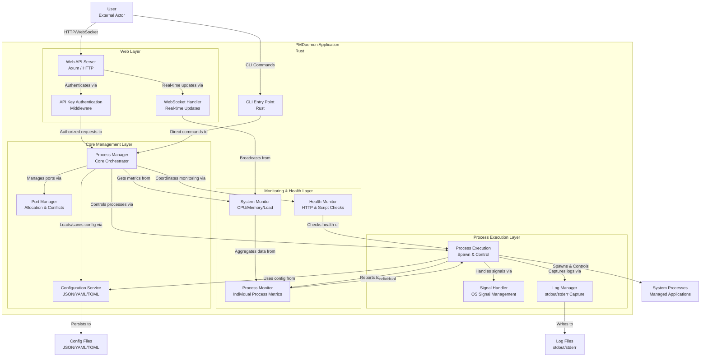

# Architecture Overview

[](https://github.com/entrepeneur4lyf/pmdaemon/stargazers)
[](https://crates.io/crates/pmdaemon)
[](https://crates.io/crates/pmdaemon)
[](https://github.com/entrepeneur4lyf/pmdaemon/blob/main/LICENSE-MIT)
[](https://github.com/entrepeneur4lyf/pmdaemon/actions/workflows/ci.yml?query=branch%3Amain)
[](https://www.rust-lang.org)
[](https://github.com/entrepeneur4lyf/pmdaemon)

PMDaemon is built with a modern, layered architecture that provides high performance, security, and maintainability. This document outlines the system's design principles and component interactions.

## System Architecture



## Design Principles

### 🏗️ **Layered Architecture**
PMDaemon follows a clean layered architecture pattern:

- **Presentation Layer** - CLI and Web API interfaces
- **Security Layer** - Authentication and authorization middleware
- **Business Logic Layer** - Core process management and orchestration
- **Monitoring Layer** - Health checks and metrics collection
- **Data Access Layer** - Configuration and log management
- **System Layer** - Direct OS process interaction

### 🔒 **Security-First Design**
- **API Key Authentication** - Optional but recommended for production
- **Middleware-based Security** - Clean separation of security concerns
- **Input Validation** - All user inputs are validated and sanitized
- **Principle of Least Privilege** - Minimal required permissions

### ⚡ **High Performance**
- **Async/Await** - Non-blocking I/O throughout the system
- **Efficient Resource Management** - Minimal memory footprint
- **Optimized Monitoring** - Cached metrics with configurable intervals
- **Zero-Copy Operations** - Where possible to reduce allocations

## Core Components

### Web Layer

#### Web API Server (Axum)
- **Purpose**: HTTP REST API for remote process management
- **Technology**: Axum web framework for high performance
- **Features**: CORS support, security headers, JSON responses
- **Endpoints**: Process management, system info, logs access

#### API Key Authentication
- **Purpose**: Secure access control for production environments
- **Implementation**: Middleware-based authentication
- **Formats**: Bearer token, ApiKey header, X-API-Key header
- **Security**: Configurable, optional for development

#### WebSocket Handler
- **Purpose**: Real-time updates and monitoring
- **Features**: Live process status, system metrics streaming
- **Protocol**: WebSocket with JSON message format
- **Performance**: Efficient broadcasting to multiple clients

### Core Management Layer

#### Process Manager
- **Purpose**: Central orchestrator for all process operations
- **Responsibilities**: 
  - Process lifecycle management (start, stop, restart)
  - Clustering and instance management
  - Configuration coordination
  - Resource allocation
- **Architecture**: Thread-safe with async operations

#### Port Manager
- **Purpose**: Advanced port allocation and conflict prevention
- **Features**:
  - Automatic port assignment
  - Range-based allocation
  - Conflict detection and resolution
  - Runtime port overrides
- **Innovation**: Goes beyond PM2's basic port handling

#### Configuration Service
- **Purpose**: Multi-format configuration management
- **Formats**: JSON, YAML, TOML ecosystem files
- **Features**: 
  - Validation and error handling
  - Hot reloading capabilities
  - Environment variable substitution
  - Schema validation

### Monitoring & Health Layer

#### Health Monitor
- **Purpose**: Application health verification
- **Types**: HTTP endpoint checks, custom script execution
- **Features**: Configurable intervals, retry logic, failure thresholds
- **Integration**: Automatic restart on health check failures

#### System Monitor
- **Purpose**: System-wide resource monitoring
- **Metrics**: CPU usage, memory consumption, load averages
- **Performance**: Efficient system calls with caching
- **Real-time**: Continuous monitoring with WebSocket broadcasting

#### Process Monitor
- **Purpose**: Individual process metrics collection
- **Metrics**: Per-process CPU, memory, uptime, restart count
- **Efficiency**: Batch processing for multiple processes
- **Accuracy**: Handles edge cases and invalid data gracefully

### Process Execution Layer

#### Process Execution
- **Purpose**: Low-level process spawning and control
- **Features**: 
  - Cross-platform process management
  - Environment variable injection
  - Working directory control
  - Resource limit enforcement

#### Signal Handler
- **Purpose**: OS signal management and forwarding
- **Platforms**: Unix signals (Linux/macOS) and Windows process control
- **Safety**: Graceful shutdown handling
- **Reliability**: Signal forwarding to child processes

#### Log Manager
- **Purpose**: Process output capture and management
- **Features**:
  - Separate stdout/stderr streams
  - Log rotation and archival
  - Real-time log following
  - Structured log formatting

## Data Flow

### 1. **Command Execution Flow**
```
User → CLI → Process Manager → Process Execution → System Process
```

### 2. **Web API Request Flow**
```
User → Web API → Authentication → Process Manager → Response
```

### 3. **Monitoring Data Flow**
```
System Process → Process Monitor → System Monitor → WebSocket → User
```

### 4. **Configuration Flow**
```
Config Files → Configuration Service → Process Manager → Process Execution
```

## Security Architecture

### Authentication Flow
1. **Request Reception** - Web API receives HTTP request
2. **Authentication Check** - Middleware validates API key
3. **Authorization** - Verified requests proceed to core system
4. **Response** - Secure response with appropriate headers

### Security Layers
- **Transport Security** - HTTPS recommended for production
- **Authentication** - API key validation
- **Input Validation** - All inputs sanitized
- **Output Sanitization** - Secure response formatting
- **Error Handling** - No sensitive information in error messages

## Performance Characteristics

### Scalability
- **Concurrent Processes** - Handles hundreds of managed processes
- **Memory Efficiency** - Low overhead per managed process
- **CPU Optimization** - Efficient monitoring with minimal system impact

### Reliability
- **Fault Tolerance** - Graceful handling of process failures
- **Recovery** - Automatic restart capabilities
- **Persistence** - Configuration and state preservation
- **Cross-Platform** - Consistent behavior across operating systems

## Technology Stack

### Core Technologies
- **Language**: Rust (memory safety, performance)
- **Async Runtime**: Tokio (high-performance async I/O)
- **Web Framework**: Axum (modern, fast HTTP server)
- **Serialization**: Serde (JSON, YAML, TOML support)
- **System Interface**: sysinfo, nix (cross-platform system calls)

### Development Tools
- **Testing**: Comprehensive test suite with 272 tests
- **Documentation**: docs.rs integration
- **CI/CD**: GitHub Actions for automated testing
- **Security**: cargo-audit for vulnerability scanning

This architecture enables PMDaemon to provide enterprise-grade process management with the performance and safety benefits of Rust, while maintaining ease of use and PM2 compatibility.
