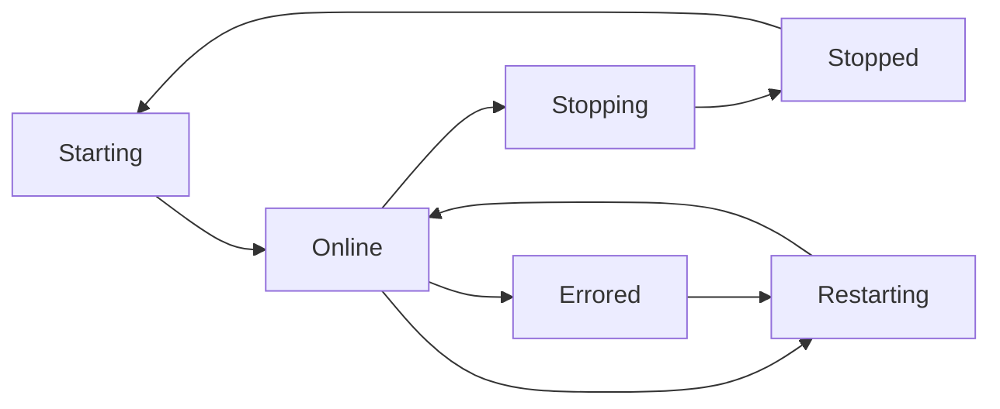

# Process Management

PMDaemon provides comprehensive process lifecycle management with enhanced features that go beyond traditional process managers. This guide covers all aspects of managing processes with PMDaemon.

## Process Lifecycle

PMDaemon manages processes through a well-defined lifecycle with clear state transitions:



### Process States

| State | Description | Color |
|-------|-------------|-------|
| **Starting** | Process is being launched | 🟡 Yellow |
| **Online** | Process is running normally | 🟢 Green |
| **Stopping** | Process is being shut down | 🟡 Yellow |
| **Stopped** | Process has exited | 🔴 Red |
| **Errored** | Process crashed or failed | 🔴 Red |
| **Restarting** | Process is being restarted | 🔵 Blue |

## Basic Operations

### Starting Processes

```bash
# Start a simple process
pmdaemon start "node server.js" --name web-app

# Start with full configuration
pmdaemon start "python app.py" \
  --name python-api \
  --instances 2 \
  --port 8000-8001 \
  --max-memory 512M \
  --cwd /path/to/app \
  --env NODE_ENV=production \
  --env DATABASE_URL=postgres://localhost/db
```

### Stopping Processes

```bash
# Stop a single process
pmdaemon stop web-app

# Stop by process ID
pmdaemon stop 0

# Stop all processes (with confirmation)
pmdaemon stop all
```

### Restarting Processes

```bash
# Standard restart
pmdaemon restart web-app

# Restart with port override
pmdaemon restart web-app --port 3001

# Restart all processes
pmdaemon restart all
```

### Graceful Reload

Zero-downtime restart for production environments:

```bash
# Graceful reload (SIGUSR2 then SIGTERM)
pmdaemon reload web-app

# Reload with new port configuration
pmdaemon reload web-app --port 4000-4003
```

## Advanced Process Management

### Clustering

PMDaemon provides automatic clustering with load balancing:

```bash
# Start 4 instances of the same application
pmdaemon start "node server.js" \
  --name web-cluster \
  --instances 4 \
  --port 3000-3003

# Auto-scale based on CPU cores
pmdaemon start "node server.js" \
  --name web-cluster \
  --instances max \
  --port auto:3000-3100
```

Each instance receives:
- **Unique PORT environment variable**
- **PM2_INSTANCE_ID** (0, 1, 2, 3...)
- **NODE_APP_INSTANCE** (for Node.js compatibility)

### Memory Management

Automatic restart when processes exceed memory limits:

```bash
# Set memory limit with automatic restart
pmdaemon start "node memory-intensive-app.js" \
  --name memory-app \
  --max-memory 1G

# Different memory formats supported
pmdaemon start app.py --max-memory 512M    # 512 megabytes
pmdaemon start app.py --max-memory 100K    # 100 kilobytes
pmdaemon start app.py --max-memory 2G      # 2 gigabytes
```

### Auto-restart Configuration

Configure how processes restart after crashes:

```bash
# Custom restart behavior
pmdaemon start "unstable-app.js" \
  --name unstable \
  --max-restarts 10 \
  --min-uptime 5s \
  --restart-delay 2s
```

**Parameters:**
- `--max-restarts`: Maximum restart attempts (default: 16)
- `--min-uptime`: Minimum uptime before considering stable (default: 1000ms)
- `--restart-delay`: Delay between exit and restart (default: 0ms)

## Enhanced Delete Operations

PMDaemon provides powerful deletion capabilities beyond simple process removal:

### Single Process Deletion

```bash
# Delete a specific process (stops if running)
pmdaemon delete web-app

# Force deletion without confirmation
pmdaemon delete web-app --force
```

### Bulk Deletion

```bash
# Delete all processes
pmdaemon delete all

# Force delete all (no confirmation)
pmdaemon delete all --force
```

### Status-based Deletion

Delete processes based on their current state:

```bash
# Delete all stopped processes
pmdaemon delete stopped --status

# Delete all errored processes
pmdaemon delete errored --status --force

# Delete all starting processes (useful for cleanup)
pmdaemon delete starting --status
```

**Valid statuses for deletion:**
- `starting` - Processes currently starting up
- `online` - Running processes
- `stopping` - Processes currently shutting down
- `stopped` - Processes that have exited
- `errored` - Processes that crashed or failed
- `restarting` - Processes currently restarting

### Safety Features

PMDaemon includes several safety features for delete operations:

1. **Automatic process shutdown** - Running processes are stopped before deletion
2. **Interactive confirmation** - Prompts for bulk operations (unless `--force`)
3. **Graceful shutdown** - Uses proper signal handling with timeouts
4. **Clear feedback** - Shows exactly what was stopped vs. deleted
5. **Error resilience** - Continues deletion even if stopping fails

## Process Information

### Listing Processes

```bash
# List all processes with detailed information
pmdaemon list
```

The list command shows:
- **ID** - Process identifier
- **Name** - Process name
- **Status** - Current state with color coding
- **PID** - System process ID
- **Port** - Assigned port(s)
- **CPU** - CPU usage percentage
- **Memory** - Memory usage (RSS)
- **Uptime** - How long the process has been running
- **Restarts** - Number of restarts

### Detailed Process Information

```bash
# Get detailed information about a process
pmdaemon info web-app
```

This shows:
- Process configuration
- Resource usage statistics
- Environment variables
- Log file locations
- Health check status
- Restart history

## Signal Handling

PMDaemon provides robust signal handling for graceful shutdowns:

### Graceful Shutdown Process

1. **SIGTERM** sent to process
2. **Grace period** (configurable timeout)
3. **SIGKILL** if process doesn't exit
4. **Cleanup** of PID files and resources

```bash
# Configure shutdown timeout
pmdaemon start "node server.js" \
  --name web-app \
  --kill-timeout 30s
```

### Custom Signal Handling

```bash
# Send custom signals to processes
pmdaemon signal web-app SIGUSR1
pmdaemon signal web-app SIGUSR2
```

## Configuration Persistence

PMDaemon automatically saves and restores process configurations:

### Automatic Persistence

- **Process configs** saved as JSON files
- **Automatic restoration** on PMDaemon restart
- **State detection** - automatically detects if processes are still running
- **Multi-session support** - works across different terminal sessions

### Configuration Locations

```bash
# Linux/macOS
~/.config/pmdaemon/processes/
~/.local/share/pmdaemon/logs/
~/.local/share/pmdaemon/pids/

# Windows
%APPDATA%\pmdaemon\processes\
%LOCALAPPDATA%\pmdaemon\logs\
%LOCALAPPDATA%\pmdaemon\pids\
```

## Environment Variables

PMDaemon automatically injects useful environment variables:

### Standard Variables

- **`PORT`** - Assigned port number
- **`PM2_INSTANCE_ID`** - Instance ID (0-based)
- **`NODE_APP_INSTANCE`** - Instance ID (Node.js compatibility)

### Custom Variables

```bash
# Set custom environment variables
pmdaemon start "node server.js" \
  --name web-app \
  --env NODE_ENV=production \
  --env DATABASE_URL=postgres://localhost/db \
  --env API_KEY=secret123
```

## Working Directory

Control where processes run:

```bash
# Set custom working directory
pmdaemon start "npm start" \
  --name frontend \
  --cwd /path/to/frontend

# Use relative paths
pmdaemon start "./build.sh" \
  --name builder \
  --cwd ../build-scripts
```

## Process Monitoring Integration

PMDaemon integrates process management with monitoring:

### Real-time Monitoring

```bash
# Monitor all processes with custom interval
pmdaemon monit --interval 2

# Monitor specific process
pmdaemon monit --filter web-app
```

### Log Management

```bash
# View recent logs
pmdaemon logs web-app --lines 50

# Follow logs in real-time
pmdaemon logs web-app --follow

# View error logs only
pmdaemon logs web-app --error
```

## Best Practices

### 1. Naming Convention

Use descriptive, consistent names:

```bash
# Good naming
pmdaemon start "node api.js" --name api-server-prod
pmdaemon start "python worker.py" --name background-worker-dev

# Avoid generic names
pmdaemon start "node app.js" --name app  # Too generic
```

### 2. Resource Limits

Always set appropriate resource limits:

```bash
pmdaemon start "node memory-intensive.js" \
  --name heavy-app \
  --max-memory 2G \
  --max-restarts 5
```

### 3. Health Checks

Use health checks for critical services:

```bash
pmdaemon start "node api.js" \
  --name critical-api \
  --health-check-url http://localhost:3000/health \
  --health-check-timeout 10s
```

### 4. Graceful Shutdowns

Configure appropriate shutdown timeouts:

```bash
pmdaemon start "node server.js" \
  --name web-server \
  --kill-timeout 30s  # Allow time for cleanup
```

## Troubleshooting

### Common Issues

1. **Process won't start**
   ```bash
   # Check logs for errors
   pmdaemon logs process-name
   
   # Verify script path and permissions
   ls -la /path/to/script
   ```

2. **Process keeps restarting**
   ```bash
   # Check if hitting memory limit
   pmdaemon info process-name
   
   # Increase memory limit or fix memory leaks
   pmdaemon restart process-name --max-memory 1G
   ```

3. **Can't delete process**
   ```bash
   # Force deletion
   pmdaemon delete process-name --force
   
   # Check if process is stuck
   pmdaemon info process-name
   ```

## Next Steps

- **[Port Management](./port-management.md)** - Advanced port allocation features
- **[Health Checks](./health-checks.md)** - Process health monitoring
- **[Monitoring](./monitoring.md)** - Real-time process monitoring
- **[Configuration](./configuration.md)** - Advanced configuration options

---

Process management in PMDaemon provides the reliability and features you need for production deployments, with enhancements that go well beyond traditional process managers.
