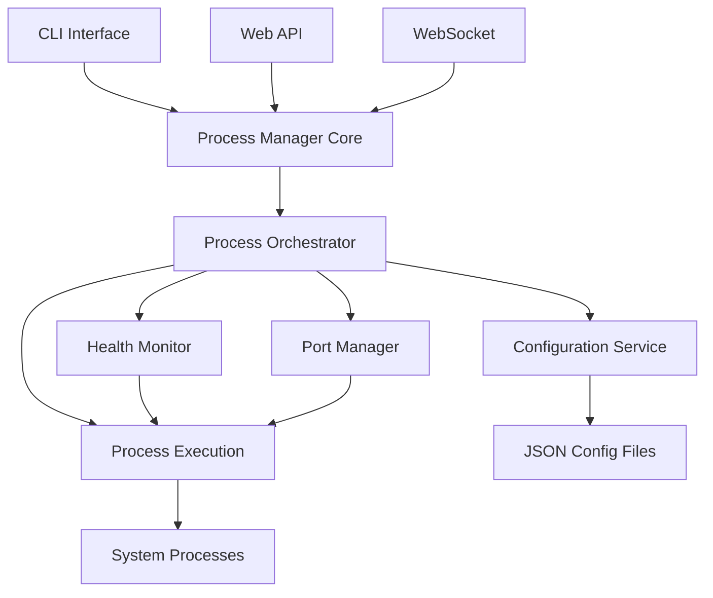

# Introduction

PMDaemon is a high-performance process manager built in Rust, inspired by PM2 with innovative features that exceed the original. It's designed for modern application deployment with advanced port management, real-time monitoring, and production-ready web APIs.

## What is PMDaemon?

PMDaemon is a **general-purpose process manager** that helps you:

- **Start, stop, restart, and monitor** applications
- **Scale applications** with clustering and load balancing
- **Manage ports** with advanced allocation and conflict detection
- **Monitor health** with HTTP and script-based checks
- **Access remotely** via REST API and WebSocket connections
- **Persist configurations** across system restarts

## Key Advantages Over PM2

PMDaemon isn't just a PM2 clone—it's PM2 **evolved** with features that the original lacks:

### 🎯 **Advanced Port Management**
- **Port range distribution** - Automatically assign consecutive ports to cluster instances
- **Auto-assignment** - Find first available port in specified ranges
- **Conflict detection** - Prevent port conflicts at the process manager level
- **Runtime overrides** - Change ports during restart without modifying saved config

### 🏥 **Health Checks & Blocking Start**
- **HTTP health checks** - Monitor endpoints with configurable timeouts
- **Script-based checks** - Custom validation logic for complex scenarios
- **Blocking start** - Wait for processes to be healthy before returning
- **Auto-restart on failure** - Automatic recovery when health checks fail

### ⚡ **Rust Performance**
- **Memory safety** - No segfaults or memory leaks
- **Blazing performance** - Efficient async/await architecture
- **Low resource usage** - Minimal overhead compared to Node.js-based tools

### 🔧 **Enhanced Operations**
- **Bulk deletion** - Delete all processes or filter by status
- **Configurable monitoring** - Customize update intervals for different needs
- **Professional display** - Beautiful tables with color-coded status indicators
- **Real-time log following** - `tail -f` functionality built-in

## Architecture Overview

## Use Cases

PMDaemon is perfect for:

### **Development**
- Running multiple microservices locally
- Hot-reloading applications during development
- Managing different environments (dev, staging, prod)

### **Production**
- Deploying Node.js, Python, Rust, or any executable
- Load balancing with automatic clustering
- Health monitoring and automatic recovery
- Remote monitoring and management

### **DevOps & CI/CD**
- Deployment scripts that wait for services to be ready
- Automated testing with health check validation
- Container orchestration and service management

## What's Next?

Ready to get started? Here's your path:

1. **[Installation](./installation.md)** - Install PMDaemon on your system
2. **[Quick Start](./quick-start.md)** - Get up and running in 5 minutes
3. **[Migration from PM2](./migration-from-pm2.md)** - Transition from PM2 seamlessly

Or dive deeper into specific features:

- **[Process Management](../features/process-management.md)** - Core lifecycle operations
- **[Port Management](../features/port-management.md)** - Advanced port allocation
- **[Health Checks](../features/health-checks.md)** - Monitoring and validation
- **[CLI Reference](../cli/commands.md)** - Complete command documentation

## Community & Support

- **GitHub**: [entrepeneur4lyf/pmdaemon](https://github.com/entrepeneur4lyf/pmdaemon)
- **Issues**: [Report bugs or request features](https://github.com/entrepeneur4lyf/pmdaemon/issues)
- **Discussions**: [Community discussions](https://github.com/entrepeneur4lyf/pmdaemon/discussions)
- **Crates.io**: [pmdaemon](https://crates.io/crates/pmdaemon)

---

**PMDaemon** - Process management, evolved. 🚀
